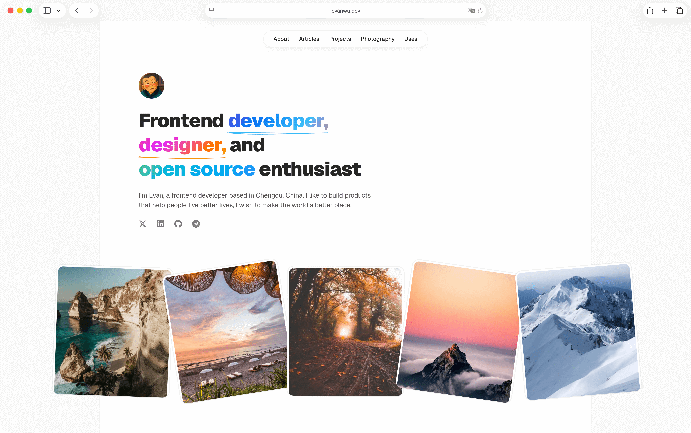

# evanwu.dev

[简体中文](./README.zh.md)

This is the repository for my personal website, [evanwu.dev](https://evanwu.dev): portfolio, blog, photography, and a few utility pages. It is built as a bilingual (English / Chinese) Next.js app and deployed on Vercel.



## Features

- **Localized routing** — English is the default locale with unprefixed URLs (`/about`). Chinese lives under `/zh/*`. Locale is driven by [next-intl](https://next-intl.dev); routing config is in `src/i18n/routing.ts` and mirrors `languine.json` (source locale `en`, target `zh`).
- **Blog / articles** — MDX files per locale in `src/content/{locale}/`, compiled on the server with [next-mdx-remote-client](https://github.com/ipikuka/next-mdx-remote-client), [remark-gfm](https://github.com/remarkjs/remark-gfm), and [Shiki](https://shiki.style) for code blocks. Reading time is computed in `src/lib/mdx.ts`.
- **Dynamic OG images** — `src/app/api/og/route.tsx` generates Open Graph images for sharing.
- **RSS** — Per-locale feeds under `src/app/[locale]/rss/route.ts`.
- **Email subscriptions** — Optional: server action in `src/actions/subscription.ts` stores signups in [Neon](https://neon.tech) PostgreSQL when `DATABASE_URL` is set.
- **Analytics** — Vercel Analytics and Speed Insights (`@vercel/analytics`, `@vercel/speed-insights`).

## Tech stack

| Area | Choice |
|------|--------|
| Framework | [Next.js](https://nextjs.org) 16 (App Router), [React](https://react.dev) 19, [React Compiler](https://react.dev/learn/react-compiler) (`reactCompiler: true` in `next.config.ts`) |
| Language | [TypeScript](https://www.typescriptlang.org) |
| Styling | [Tailwind CSS](https://tailwindcss.com) v4 (`@tailwindcss/postcss`) |
| i18n | [next-intl](https://next-intl.dev) — `useTranslations()`, locale-aware `Link` / router from `src/i18n/navigation.ts` |
| Content | MDX + YAML frontmatter; UI copy in `messages/en.json` and `messages/zh.json` |
| MDX | Custom components in `src/components/mdx.tsx` (headings, links, code via `mdx-code`) |
| UI | [Radix UI](https://www.radix-ui.com) (Dialog, Tooltip), [lucide-react](https://lucide.dev), [motion](https://motion.dev) |
| Theming | [next-themes](https://github.com/pacocoursey/next-themes) |
| Validation | [Zod](https://zod.dev) (e.g. subscription form) |
| Quality | [Biome](https://biomejs.dev) — `bun run lint` runs `biome format --write` |
| Package manager | [Bun](https://bun.sh) |

## Repository layout

```
src/
  app/
    [locale]/          # Localized pages: home, about, articles, projects, photography, uses, …
    api/og/            # OG image route
    robots.ts, sitemap.ts
  actions/             # Server actions (e.g. subscription)
  components/          # React components (RSC by default; `'use client'` only when needed)
  content/
    en/, zh/            # *.mdx articles per locale
  i18n/                  # routing.ts, navigation.ts, request.ts
  lib/                   # mdx.ts, constants (resume, projects, nav), fonts, rss, …
  styles/                # Global CSS
messages/
  en.json, zh.json       # next-intl message catalogs
```

Shared data (navigation, resume snippets, projects, social links) is centralized in `src/lib/constants.ts`.

## Article frontmatter

Each `src/content/{locale}/*.mdx` file can include YAML frontmatter:

```yaml
---
title: 'Article title'
description: 'Short description for SEO and listings'
publishedAt: 'YYYY-MM-DD'
image: '/optional-og-or-card-image.png'
---
```

Slugs are derived from the filename (e.g. `react-server-component.mdx` → `/articles/react-server-component`).

## Environment variables

| Variable | Required | Purpose |
|----------|----------|---------|
| `DATABASE_URL` | No | Neon connection string for the email subscription feature. Without it, other site features still work; only the subscription action needs the DB. |

Vercel sets `NODE_ENV`; local dev defaults to `http://localhost:3000` for RSS/OG base URLs where applicable.

## Development

```bash
bun install
bun dev              # Next dev (Turbopack)
bun run build        # Production build
bun run start        # Run production server locally
bun run typecheck    # tsc --noEmit
bun run lint         # Biome: format with --write
```

## Conventions (short)

- Prefer **named exports**; default exports only where the framework requires them.
- **kebab-case** directories, **PascalCase** component files.
- Path aliases: `@/*` → `./src/*`.
- Formatting: Biome — 2-space indent, single quotes, no semicolons, ~80-char width (see `biome.json`).

## Deployment

The site is intended to run on **Vercel**. Connect the repo, set `DATABASE_URL` if you use subscriptions, and deploy. `sitemap.ts` and `robots.ts` live under `src/app/` for crawlers.
